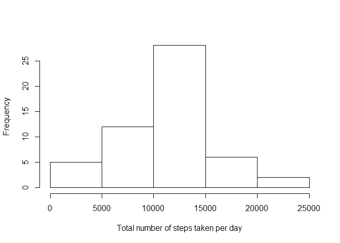
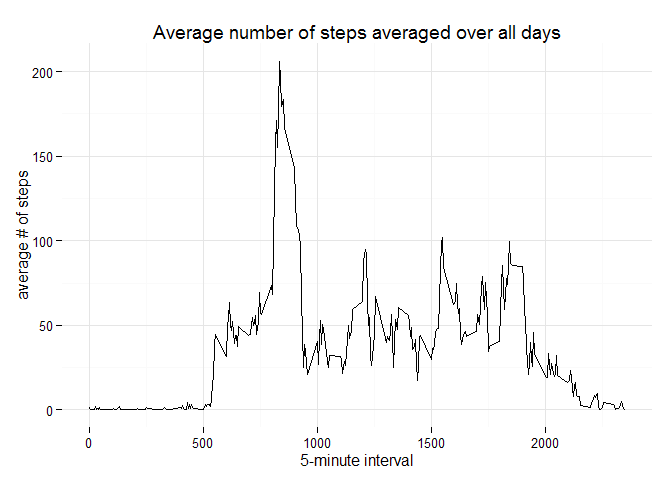
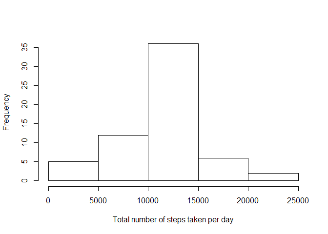
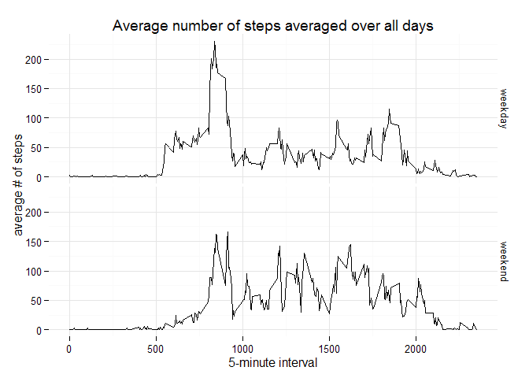

# Reproducible Research: Peer Assessment 1
Rob  
20 september 2015  

```r
## in inline R code output: numbers >= 10^5 will be denoted in scientific notation,
## and rounded to 2 digits
options(scipen = 1, digits = 2)
```

##Introduction

It is now possible to collect a large amount of data about personal movement using activity monitoring devices such as a Fitbit, Nike Fuelband, or Jawbone Up. These type of devices are part of the "quantified self" movement - a group of enthusiasts who take measurements about themselves regularly to improve their health, to find patterns in their behavior, or because they are tech geeks. But these data remain under-utilized both because the raw data are hard to obtain and there is a lack of statistical methods and software for processing and interpreting the data.

This assignment makes use of data from a personal activity monitoring device. This device collects data at 5 minute intervals through out the day. The data consists of two months of data from an anonymous individual collected during the months of October and November, 2012 and include the number of steps taken in 5 minute intervals each day.
Data

The variables included in this dataset are:

    - steps: Number of steps taking in a 5-minute interval (missing values are coded as NA)
    - date: The date on which the measurement was taken in YYYY-MM-DD format
    - interval: Identifier for the 5-minute interval in which measurement was taken

The dataset is stored in a comma-separated-value (CSV) file and there are a total of 17,568 observations in this dataset.


## Loading and preprocessing the data


```r
unzip(zipfile = "activity.zip")
data <- read.csv("activity.csv")
```


## What is mean total number of steps taken per day?

In this part of the assignment, the missing values in the dataset can be ignored.

A histogram of the total number of steps taken each day:

```r
AantalStappenPerDag <- aggregate(steps ~ date, data, sum, na.rm = TRUE)
hist(AantalStappenPerDag$steps, main=NULL, xlab='Total number of steps taken per day')
```

 


```r
mean(AantalStappenPerDag$steps)  
```

```
## [1] 10766
```

```r
median(AantalStappenPerDag$steps)
```

```
## [1] 10765
```

- The __mean__ of the total number of steps taken per day is 10766.19.
- The __median__ of the total number of steps taken per day is 10765. 

## What is the average daily activity pattern?


```r
library(ggplot2)
GemAantalStappenPerInterval <- aggregate(steps ~ interval, data, mean, na.rm = TRUE)
ggplot(data = GemAantalStappenPerInterval, aes(x = interval, y = steps)) + 
  geom_line() + 
  theme_minimal() +
  ggtitle("Average number of steps averaged over all days") +
  xlab("5-minute interval") + 
  ylab("average # of steps")
```

 


```r
MaxGemIndex <- which.max(GemAantalStappenPerInterval$steps)
GemAantalStappenPerInterval[MaxGemIndex, ]$interval
```

```
## [1] 835
```

```r
GemAantalStappenPerInterval[MaxGemIndex, ]$steps
```

```
## [1] 206
```

5-minute interval __835__, on average across all the days in the dataset, contains the maximum number of steps (206.17).

## Imputing missing values

```r
sum(is.na(data$steps))
```

```
## [1] 2304
```
The total number of missing values in the dataset (i.e. the total number of rows with NAs) is equal to __2304__.

A new dataset is made, with missing data replaced by the average number of steps for that 5-minute interval as computed above.

```r
dataAangevuld <- data  
for (i in 1:nrow(dataAangevuld)) {
    if (is.na(dataAangevuld[i, ]$steps)) {
        dataAangevuld[i, ]$steps <- GemAantalStappenPerInterval[GemAantalStappenPerInterval$interval==dataAangevuld[i, ]$interval,]$steps
    }
}
```


A histogram of the total number of steps taken each day (with missing values filled in):

```r
AantalStappenPerDagAangevuld <- aggregate(steps ~ date, dataAangevuld, sum, na.rm = TRUE)
hist(AantalStappenPerDagAangevuld$steps, main=NULL, xlab='Total number of steps taken per day')
```

 


```r
mean(AantalStappenPerDagAangevuld$steps)  
```

```
## [1] 10766
```

```r
median(AantalStappenPerDagAangevuld$steps)
```

```
## [1] 10766
```

- The __mean__ of the total number of steps taken per day is 10766.19, compared to  10766.19 without missing values.
- The __median__ of the total number of steps taken per day is 10766.19, compared to  10765 without missing values. 

## Are there differences in activity patterns between weekdays and weekends?
In this part of the assignment, the missing values in the dataset are filled in.

A new factor variable is created in the dataset with two levels -- "weekday" and "weekend" indicating whether a given date is a weekday or weekend day.

```r
dataAangevuld$dayType <- ifelse(as.POSIXlt(dataAangevuld$date)$wday %in% c('0','6'),'weekend','weekday')
```

Plotted as a panel plot:

```r
library(ggplot2)
GemAantalStappenPerIntervalAangevuld <- aggregate(steps ~ interval + dayType, dataAangevuld, mean, na.rm = TRUE)
ggplot(data = GemAantalStappenPerIntervalAangevuld, aes(x = interval, y = steps)) + 
  facet_grid(dayType ~ .) + 
  geom_line() + 
  theme_minimal() +
  ggtitle("Average number of steps averaged over all days") +
  xlab("5-minute interval") + 
  ylab("average # of steps")
```

 
